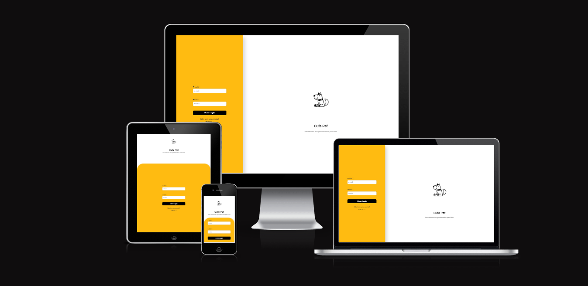
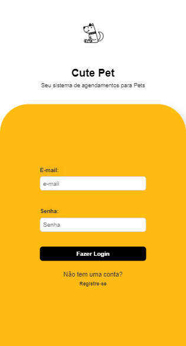
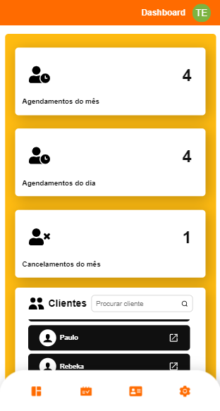
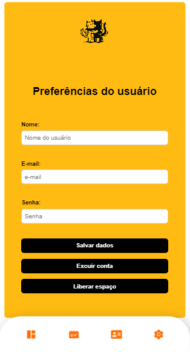
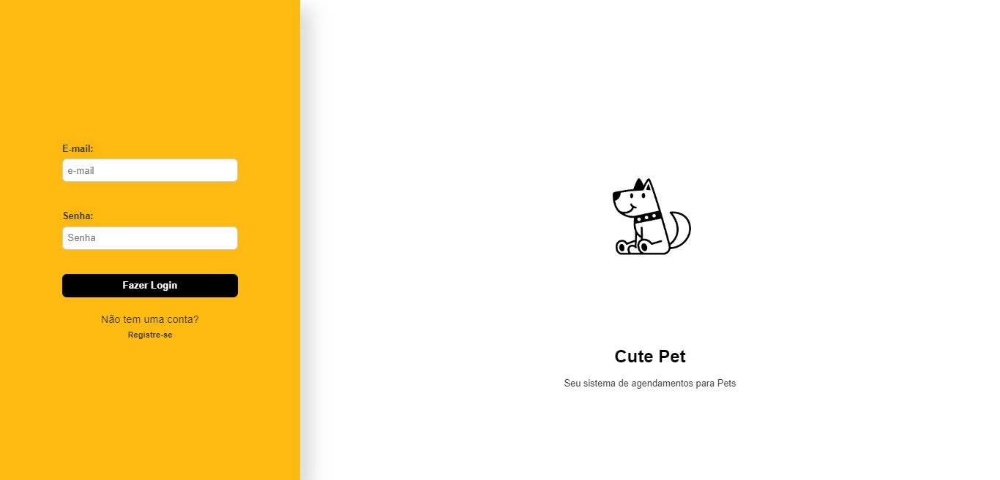
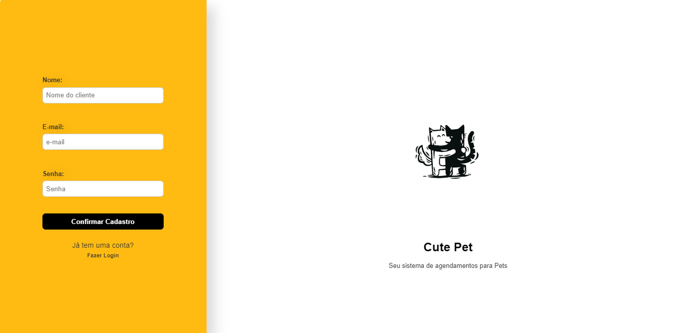
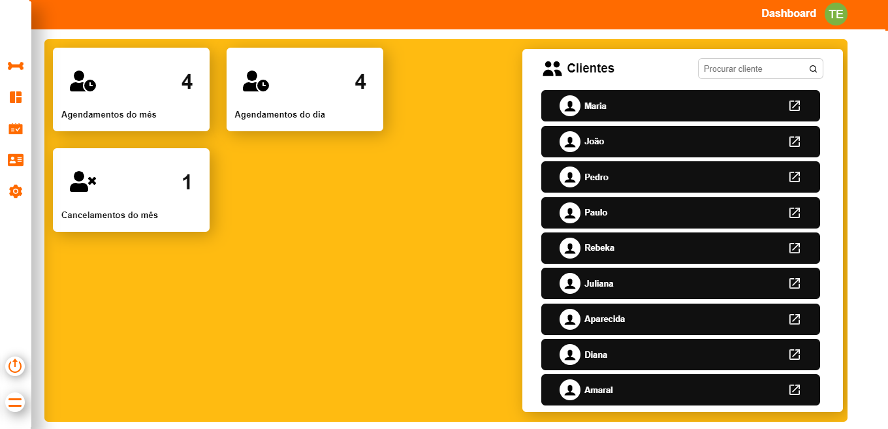
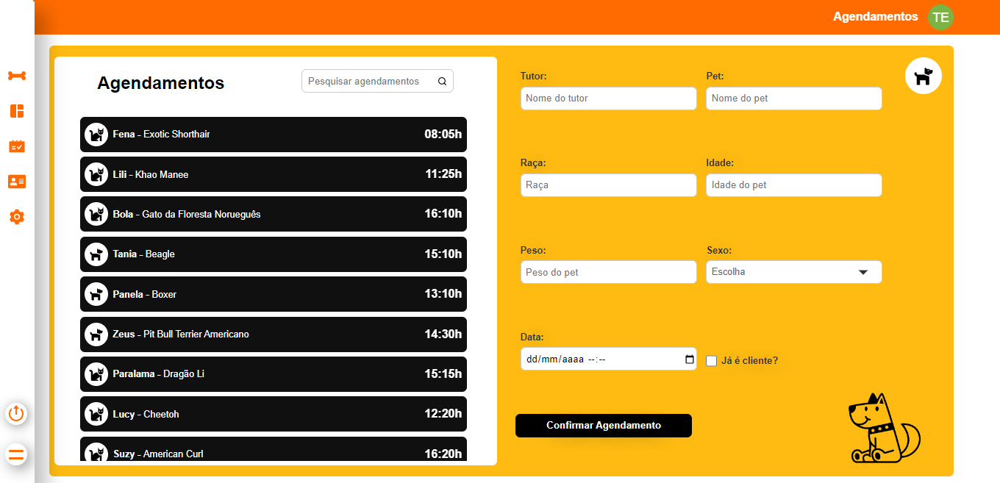

#

<h1>Cute Pet   

Sistema de Agendamentos para PetShop

</h1>

## Descrição

[Ver Projeto](https://schedule-petshop-system.vercel.app) 🐶🐱🐾

#### O Cute Pet é um sistema completo de agendamento de petshop, desenvolvido com a tecnologia Next.js e TypeScript. Com ele, é possível cadastrar clientes e seus pets, bem como agendar atendimentos e atualizar as informações cadastradas a qualquer momento. Com uma interface amigável e intuitiva, o Cute Pet oferece uma experiência de uso agradável e eficiente para seus usuários. Além disso, o sistema conta com um banco de dados robusto, desenvolvido com Node.js, Prisma e MongoDB, o que garante alta performance e escalabilidade. Se você é um profissional do ramo pet e deseja gerenciar seus agendamentos de forma mais organizada e eficiente, o Cute Pet é a solução ideal para o seu negócio. Com ele, você pode gerenciar seus clientes e seus pets de maneira simples e prática, garantindo um atendimento de qualidade e fidelizando seus clientes.

#

#

## _Layout Mobile_

#

## _Layout Web_

#

#

#

#

## 🛠️ Tecnologias

💻 **Front-end**
- [Next.js](https://nextjs.org)
- [TypeScript](https://www.typescriptlang.org)
- [i18n](https://react.i18next.com)
- [thedogapi - thecatapi](https://thedogapi.com)

📚 **Bibliotecas**
- [react-hook-form](https://react-hook-form.com)
- [react-toastify](https://www.npmjs.com/package/react-toastify)
- [react-input-mask](https://www.npmjs.com/package/react-input-mask#examples)
- [react-datepicker](https://www.npmjs.com/package/react-datepicker)
- [react-icons](https://react-icons.github.io/react-icons)
- [dayjs](https://day.js.org/)
- [jsonwebtoken](https://jwt.io/)
- [nookies](https://www.npmjs.com/package/nookies)
- [bcrypt](https://www.npmjs.com/package/bcrypt)

📁 **Back-end**
- [Prisma](https://www.prisma.io)
- [Node.js](https://nodejs.org)
- [MongoDB](https://www.mongodb.com)

🎨 **Estilização**
- [Styled-Components](https://styled-components.com)

🔋 **Versionamento e Deploy**
- [Git](https://git-scm.com)
- [Vercel](https://vercel.com/)

 

⚙️ **Configuranções e Instalações**

Clone do Projeto

    $ git clone https://github.com/renovatt/schedule-petshop-system.git

Instalando as dependências

    $ npm install

Iniciando o projeto

    $ npm run dev

 

**Como contribuir?**

- Você pode dar suporte me seguindo aqui no GitHub
- Dando uma estrela no projeto
- Criar uma conexão comigo no linkedin fazendo parte da minha networking e curtir o meu projeto.

 

**Autor**
[Wildemberg Renovato de Lima](https://www.linkedin.com/in/renovatt/)